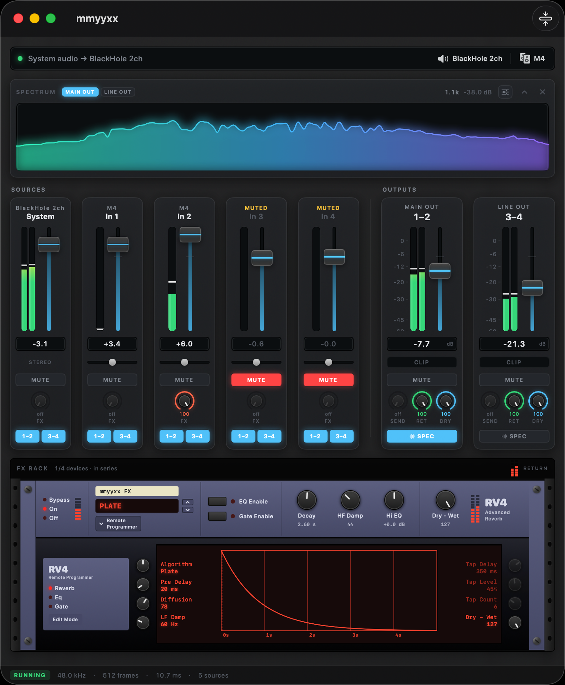

# mmyyxx

A small macOS mixer that drives **every** output pair on a multi-output audio
interface at once, instead of just the first stereo pair macOS is willing to use.
System audio and the interface's own hardware inputs each get a channel strip,
and each strip can be sent to either output pair independently.

Built for a MOTU M4 (Main Out 1–2, Line Out 3–4, four analog inputs), but any
interface with four or more outputs appears in the device menu.



A spectrum analyser across the top, five input strips feeding two output pairs,
and a rack below that either can send to. The RV4 here is running Plate.

## Why this is needed

macOS only ever sends system audio to channels 1–2 of the selected output device.
Audio MIDI Setup cannot work around it: a Multi-Output Device aggregates
*separate devices*, so it has no way to split one device's channel pairs. Setting
the interface to a quadraphonic speaker layout does not help either, because
stereo content still lands on the front pair.

## How it works

```
System audio ──▶ BlackHole 2ch ─┐
                                ├─▶ private aggregate ─▶ mmyyxx mixer ─┬─▶ M4 out 1–2
   MOTU M4 inputs + outputs ────┘        (one IOProc)                  └─▶ M4 out 3–4
        (clock master)
```

BlackHole is a virtual output driver: point macOS at it and system audio becomes
readable as an input. The app then wraps BlackHole and the interface in a
**private aggregate device**, which is the part that makes this reliable. The two
devices have independent clocks, so servicing them from separate callbacks would
need a ring buffer and a resampler to absorb drift. Inside one aggregate,
CoreAudio does that work: the interface is clock master, BlackHole gets drift
compensation, and a single IOProc receives every input and output channel already
sample-aligned. The aggregate is marked private, so it stays out of Audio MIDI
Setup and the Sound menu.

Sub-device ordering matters. The interface is listed first, so its inputs occupy
the low aggregate channel indices and BlackHole's follow — on an M4 that puts
In 1–4 at 0–3 and system audio at 8–9.

### Signal flow

```
sources ──(fx send, post-fader)──┐
                                 ├──▶ FX bus ──▶ rack ──▶ return ──┐
pair bus ──(fx send)─────────────┘      (tapped pre-return)        │
    │                                                              │
    └──(dry)──────────────────────────┬───────────────────────────-┘
                                      └──▶ pair fader ──▶ output
```

The render callback runs in passes:

1. Each source applies its own smoothed gain and pan, meters itself **pre-fader**
   so a channel still shows signal with the fader down, and sums into whichever
   output pairs its send buttons select, plus the FX bus.
2. Each output pair can also feed the FX bus. That tap happens **before** the
   return is summed back in, which is what stops a pair that both sends to and
   receives from the reverb from closing a feedback loop.
3. Each output pair scales its own signal by its **DRY** amount, sums the return,
   applies its master fader and meters **post-fader**, so the output strips show
   what is actually leaving the interface.

FX sends default to zero, so nothing is heard until a send is raised.

DRY defaults to full, which makes the rack a parallel send: right for a reverb,
wrong for an EQ, since half the signal would bypass it and an EQ move would land
at half strength. Take DRY to zero with the send up and the rack becomes an
insert on that output instead. The dry path is only thinned when something is
actually coming back, so a bypassed rack cannot silence an output.

Gain smoothing advances once per frame regardless of how many pairs a source
feeds, so slew rate does not depend on routing.

The callback allocates nothing and takes no locks. Parameters cross from the UI
through atomics, meter peaks cross back with max-since-last-read semantics, and
fader moves slew over ~20 ms so they do not zipper.

### Two things that bite

**Loopback channels are excluded.** The M4 exposes `Loopback 1–2` and
`Loopback Mix 1–2` alongside its analog inputs. Those return what the computer is
sending to the interface, which is exactly what this app writes, so routing one
into the mix would close a feedback loop. Sources whose driver-supplied channel
name contains "loopback" are filtered out.

**A reconnecting interface can hand back a short channel layout.** An interface
that has just enumerated over USB will advertise four outputs while contributing
fewer channels to the aggregate. Every channel index after the short sub-device
shifts, which puts what the app calls Main Out on the loopback device's outputs
instead — and that comes straight back in as system audio and rings.

The engine refuses to start until the interface contributes its full channel
count, retrying while it settles, and the render callback never writes outside
the interface's own range. The safety mute covers the same window from the other
side by holding the outputs silent until playback is real.

**Output volume is claimed and held at unity.** Interfaces typically expose a
software volume control only on their "preferred stereo pair", because that is
the pair the macOS volume slider drives. On the M4 that means channels 1–2 carry
a volume control and 3–4 do not, so the two pairs can sit 30 dB apart with no
visible cause.

Claiming it once at startup turned out not to be enough: something in the system
puts that value back to a remembered level afterwards, and the app had no idea,
leaving Main Out 30 dB down while every fader read normal. A property listener
now holds each claimed control at unity for as long as the engine runs. Nothing
contends for it, because the interface's front-panel knob is analogue and sits
downstream of the digital control.

The original levels are written to the settings file while they are held and
cleared on a clean exit. A non-empty record on launch means the last run ended
unexpectedly, and those are the levels to give back, so a crash cannot make the
app mistake its own unity value for the user's setting.

**The macOS volume slider moves to the wrong end of the chain.** Once system
output points at BlackHole, that slider stops being the last stage before the
speakers and becomes the first stage before the mixer, attenuating digitally
before anything is summed.

Rather than fight that, the System strip's fader *is* that control. It reads and
writes the loopback device's volume directly, so the strip, the macOS slider and
the keyboard volume keys are all the same value and can never disagree. A
CoreAudio property listener keeps the fader in sync when the volume changes from
outside the app. The System source's gain inside the mixer stays pinned at unity,
so there is exactly one gain stage rather than two.

**BlackHole's volume taper is linear, and the mixer corrects for it.** Measured
on the device, its curve is exactly `dB = 64 x (scalar - 1)`. Because the macOS
volume keys always move in fixed 1/16 steps, that makes every key press a flat
4 dB regardless of position, which is far coarser than any normal output device
and is what makes the keys feel steppy.

The mixer imposes a cubic taper instead, applying the difference between what
the device reports it is doing and what the curve calls for:

| Key step | BlackHole alone | With correction |
|---|---|---|
| 16/16 | 0.0 dB | 0.0 dB |
| 15/16 | -4.0 dB | -1.7 dB |
| 14/16 | -8.0 dB | -3.5 dB |
| 12/16 | -16.0 dB | -7.5 dB |
| 8/16 | -32.0 dB | -18.1 dB |
| 4/16 | -36.1 dB | -36.1 dB |

The correction is derived from the dB the device reports rather than from a
hardcoded formula, so a loopback driver with a different curve lands on the same
result. It peaks near +14 dB around half travel and can never raise the signal
above its original level, so it cannot clip.

Hold Option-Shift with the volume keys for quarter steps if you want finer
control still.

The interface's per-channel **mute** is claimed the same way and restored on
exit, for the same reason: the M4 carries one only on channels 1–2, so a mute
from the keyboard leaves that pair dead while 3–4 keep playing.

> A force-quit still leaves the controls at unity until the next clean exit, but
> the levels to restore survive it.

## Requirements

- macOS 15 or later
- Command Line Tools 16.4+ (`swift --version` should report 6.1 or newer)
- [BlackHole 2ch](https://github.com/ExistentialAudio/BlackHole): `brew install --cask blackhole-2ch`

After installing BlackHole, `sudo killall coreaudiod` makes it visible without a
reboot.

## Install

A signed disk image is at **[xselement.com/downloads/mmyyxx.dmg](https://xselement.com/downloads/mmyyxx.dmg)**,
and is attached to each [release](https://github.com/sqratchsix/mmyyxx-audio-router/releases).
It is **Apple silicon only**. The image and the app inside it are signed with a
Developer ID, notarized, and the ticket is stapled to the image, so it opens on a
machine that has never seen it and works offline. Drag it to Applications and
double-click; there is no quarantine dance.

BlackHole has to be installed separately, see Requirements above. The app detects
when it is missing and shows the command.

## Build and run

```sh
./build.sh              # release build, produces build/mmyyxx.app
open build/mmyyxx.app
```

`./build.sh debug` for a debug build.

The bundle is signed so macOS remembers the audio-input permission between
launches. A Developer ID Application identity is used when one is installed,
otherwise the signature is ad-hoc, which is enough locally but cannot travel.
Override with `MMYYXX_SIGN_IDENTITY`, or set it to `-` to force ad-hoc.

```sh
./build.sh release --dmg        # also package build/mmyyxx-<version>.dmg
./build.sh release --notarize   # ...and notarize it, then staple the ticket
```

Notarizing needs credentials stored once, with the profile named `mmyyxx`
(or set `MMYYXX_NOTARY_PROFILE`):

```sh
xcrun notarytool store-credentials mmyyxx --apple-id <id> --team-id <team>
```

The disk image keeps one stable name so published links keep working, and takes
its version from `CFBundleShortVersionString`. Bump that in `Bundle/Info.plist`
before packaging a new release.

There is no Xcode project file. The package builds with Command Line Tools alone;
Xcode 16.4 can open `Package.swift` directly if you want previews and Instruments.
Note that Xcode 26 requires macOS 26, so 16.4 is the last version that runs on
macOS 15.

The icon is generated rather than checked in as an opaque asset:

```sh
./Tools/make-icon.sh    # rewrites Resources/AppIcon.icns
```

## First run

1. Install BlackHole, then `sudo killall coreaudiod`.
2. Launch the app and click **Route here** in the source bar. That points macOS
   system output at BlackHole, and the app restores your previous output device
   on quit.
3. Turn your monitors down first. Pinning channels 1–2 to unity can be a large
   jump from wherever the system slider left them.

Hardware inputs start muted and at −∞, so plugging in a live microphone never
surprises anyone through the speakers. Unmute and raise the fader to use one.

The output device can be chosen from the bar at the top of the window, so
switching what macOS is playing through does not mean a trip to System Settings.

### The safety mute

The outputs are held silent when the engine starts and open when system audio is
genuinely playing, which is what the amber **Held silent** pill in the bar means.
**Open now** releases it by hand, and the device menu has a switch to turn the
behaviour off.

It exists because an interface that has just been plugged back in can carry a
channel layout that is briefly wrong, and an open microphone plus a wrong layout
is a feedback loop through the monitors. The hold covers that window.

The engine also clears the interface's own per-channel mute while it runs and
puts it back on exit. Muting from the keyboard while the interface is the system
output leaves its preferred pair dead and the others playing — from inside the
app that looks like a broken output rather than a muted one, with faders moving,
meters reading level and nothing coming out.

## Controls

| Control | Behaviour |
|---|---|
| Fader | Console taper: unity at 75% of travel, +6 dB at the top. Double-click resets to 0 dB. |
| Pan | Constant-power, with a centre detent. Mono sources only. Double-click recentres. |
| SEND 1–2 / 3–4 | Which output pairs this source feeds. |
| MUTE | Per source and per output pair. |
| FX | Post-fader send into the rack, so muting a channel takes its reverb with it. |
| SEND / RET / DRY | Per output pair: level into the rack, level back, and how much of the pair's own signal survives alongside it. |
| SPEC | Sends this pair to the analyser above the sources. |
| CLIP | Latches while a pair's post-fader peak hold sits at 0 dBFS. |

## The rack

The FX send feeds a 19-inch rack with mounting rails that holds up to four
devices chained in series. Device panels are a whole number of rack units and
never stretch, so a 1U panel stays 1U at any window size.

| Device | Height | |
|---|---|---|
| RV4 Advanced Reverb | 3U, folds to 1U | main panel plus Remote Programmer |
| DL1 Delay Line | 1U | stereo delay, damped feedback, ping-pong |
| EQ5 Parametric EQ | 3U, folds to 1U | five bands, presets, response curve |
| SA1 Spectrum Analyser | 3U, folds to 1U | reads the bus where it is mounted |

Each device is fastened by full-height mounting ears with a screw top and bottom,
and the rack is exactly as tall as what is mounted in it. The window's minimum
width is the rack's, because a 19-inch rack that has to squeeze is not a 19-inch
rack; below that the window scrolls rather than clipping.

Hover a device for its power, reorder and remove controls, and hover the rack's
header for **Add device**. A collapsible device folds to 1U with the button under
its name, which is how four devices fit on a screen at once. Each slot owns both a
reverb and a delay from the moment the app starts: adding a device at runtime
must never make the audio thread allocate a delay line, so the units are pooled
and a slot simply uses whichever its current kind calls for. Changing a slot's
device type clears that unit, which is a buffer memset rather than an allocation.

The chain snapshot handed to the render thread is deliberately not an `Array`.
It is a fixed-capacity plain-old-data struct, so copying it is a memcpy; an array
would retain and release a heap buffer, and dropping the last reference would
call `free` on the audio thread.

## The analyser

A spectrum analyser appears twice, from one piece of DSP.

Above the sources is a panel fed by the **SPEC** buttons on the output strips:
what it draws is the post-fader mono sum of whichever pairs are sending, which is
what the speakers are actually getting. Double-click its header to fold it to a
single line with the trace still running.

In the rack, **SA1** is an insert like anything else in the chain and reads the
FX bus *where it is mounted*: ahead of the RV4 it shows the dry send, behind it
the tail. Two of them read their own points in the chain.

The render thread writes into a lock-free ring and the FFT runs on the UI thread,
Hann-windowed, so the audio thread never does a transform. Calibration was
checked against synthesised sines: a full-scale tone reads 0 dBFS within the
scalloping loss a Hann window costs. Tilt is applied to signal only — adding it
to the silence floor lifts digital silence into view as a phantom ramp climbing
toward 20 kHz.

Everything about it is adjustable: FFT size, band count, attack and release,
tilt, floor and ceiling, refresh rate, peak hold, and five drawing styles across
six palettes.

## The EQ

**EQ5** is five bands — low shelf, three bells, high shelf — with presets that
write the bands and then get out of the way. Move any control afterwards and the
preset reads *Custom*; **Reset bands** returns it to flat.

The response curve is drawn from the same biquad coefficients the audio runs
through rather than an approximation of them, so what is on screen is the filter.
Folded to 1U the curve scales itself to what the EQ is doing, since a working
±5 dB move on a fixed ±18 dB scale is a straight line.

Coefficients are rebuilt only when a value actually moves, which keeps the
trigonometry off the per-buffer path while a curve sits still.

## The reverb

**RV4** is modelled on Reason's RV7000: a main panel with the headline controls
and a Remote Programmer below carrying the rest on a red LCD.

Six of the algorithms are a feedback delay network — eight delay lines with
mutually non-harmonic lengths, a four-stage allpass diffuser on the input, and a
Householder feedback matrix. The matrix is orthogonal, so it redistributes energy
between lines without adding or removing any; decay is set purely by the per-line
feedback gains, which keeps RT60 predictable. Small Space through Arena differ by
how far the delay set is stretched; Plate and Spring add diffusion density. Echo
and Multi Tap bypass the network for a tap-based path, and Reverse plays
crossfaded grains backwards into it.

Multi Tap fans the delay line out up to 16 times.

**Decay compensation.** The damping filters inside the feedback path shave a
little off the midband on every pass, and at tens of passes per second that
compounds. Measured with an impulse test, a 20 s Decay setting was decaying in
about 3 s. The feedback gain is now divided by the filters' measured loss at
500 Hz, so Decay means RT60 again while the top end still dies away first.

**Switching without a pop.** Changing algorithm moves every delay-line read
position and every filter coefficient at once, which is a step discontinuity and
audible as a click. The wet output ramps to silence over ~12 ms, the new settings
are applied at the zero crossing, and it ramps back up. Delay times are handled
differently: they glide rather than crossfade, because sliding a read position
bends the pitch briefly instead of stepping, which is what a delay is expected to
do when you turn the time knob. Measured across every algorithm pair, the worst
sample-to-sample delta during a switch is now *smaller* than the signal's normal
slew.

## Performance

Metering is the only thing that runs continuously, and it needs care.

The first working version idled at **98% of a core**. Profiling showed the cost
was almost entirely SwiftUI *layout*, not drawing and not DSP: `AppModel` was one
`ObservableObject`, so a meter tick invalidated the whole view tree and the engine
re-solved `sizeThatFits` across every nested stack in the window. The reverb
itself measured 0.2%.

Three changes took it to roughly 13% visible and 0.5% hidden:

- Metering moved into its own `MeterModel`, so only the leaf views that draw a
  meter subscribe to it. Anything that merely passes it along holds it as a plain
  `let`; making it `@ObservedObject` higher up brings the problem straight back.
- Each meter group draws in a single fixed-size `Canvas` instead of a view per bar
  and per scale tick. One layout node regardless of what is inside it.
- 30 Hz instead of 60, and metering pauses entirely when the window is occluded.

## Settings

Every fader, pan, mute and send is persisted to:

```
~/Library/Application Support/com.jaredsimon.mmyyxx/settings.json
```

Sources are keyed by a stable id (`system`, or `<device-uid>#<channel>`) rather
than by position, so unplugging an interface and reconnecting it restores that
strip's mix instead of resetting it. Settings for absent devices are kept in the
file rather than pruned.

Writes are debounced by 0.75 s, because a fader drag emits a change per frame and
each one would otherwise be a file write. Writes are atomic, so a crash mid-save
leaves the previous file intact rather than a truncated one. Anything loaded from
disk is range-checked before it reaches the render path, so a hand-edited or
stale file cannot crash the engine.

The device menu has **Reset mix to defaults** and **Reveal settings file**.

## Layout

```
Sources/Audio/   CoreAudio layer: device discovery, aggregate device, mixer callback, DSP, level math
Sources/UI/      SwiftUI views: meters, faders, channel strips, rack devices, theme
Sources/App/     App entry point, the observable model bridging UI to engine, and the analyser
Bundle/          Info.plist and entitlements consumed by build.sh
Tools/           Icon generator
```

## Status

Working: system audio and all four M4 analog inputs as independent sources, each
with gain, pan, mute and per-pair sends; two output pairs with master faders,
mutes and clip indicators; peak metering with hold throughout; device selection;
system-output routing with restore on quit.

Also working: a rack of up to four devices in series — reverb, delay, EQ and
analyser — with each output pair able to run it as a send or as an insert; a
spectrum analyser both above the mix and in the rack; the output device chosen
from the window; and a safety mute that holds the outputs down until playback is
real. The full mix persists across launches and across device reconnects.

Not done yet: buffer size is whatever the aggregate negotiates rather than
something the app sets. There is no menu bar item, so the window is the only
way to reach the controls.
